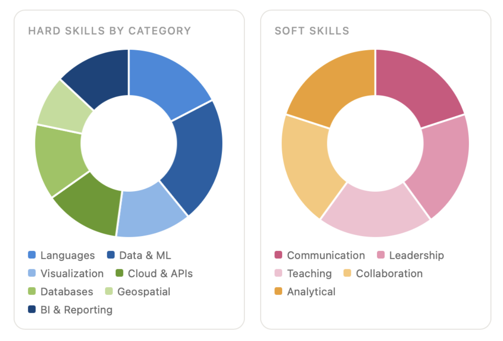

 

---

---

## About Me

<table>
<tr>
<td>

Before data science, I spent eight years as an educator, ran a crisis nonprofit through a difficult staff transition, and coordinated teams across very different environments. Those years taught me how to communicate across any room and how to keep complex work organized when the stakes are high. I brought those skills into tech and built on them. Now I am an MS candidate at **Northeastern University** and **Data Analyst Intern at Basham & Scott LLC**, building ML systems, ETL pipelines, and geospatial tools that process 100K+ records. I can build the thing and explain it to anyone who needs to use it.

</td>
</tr>
</table>

---

## Skills

<table>
<tr>
<td valign="top" width="33%">

**Languages** 
   

 

**Data Analysis & ML** 
       

 

**BI & Reporting** 
   

</td>
<td valign="top" width="33%">

**Visualization** 
   

 

**Cloud & APIs** 
   

 

**Database & Tools** 
    

 

**Geospatial** 
  

</td>
<td valign="top" width="33%">

**Education & Leadership** 
   

 

**Operations** 
    

</td>
</tr>
</table>

---

## Featured Projects

<table>
<tr>
<td width="50%" valign="top">

****

NLP and ML system to score ~100K legal claims in real time for a law firm. Team Lead.

     

</td>
<td width="50%" valign="top">

****

ETL pipeline for 54K+ patient records with K-Means clustering to identify geographic health trends.

      

</td>
</tr>
<tr>
<td width="50%" valign="top">

****

Automated RFM segmentation pipeline analyzing 6 months of transaction data for local businesses.

   

</td>
<td width="50%" valign="top">

****

Analysis of school closure risk across Maine using enrollment, infrastructure, and demographic data.

    

</td>
</tr>
</table>

---

## Currently

---

## Let's Connect

---

